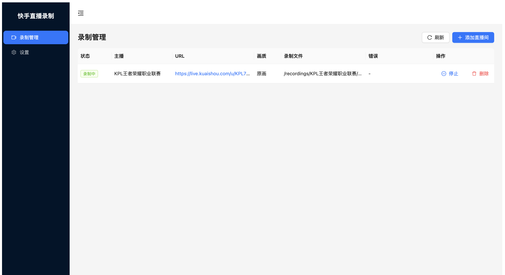
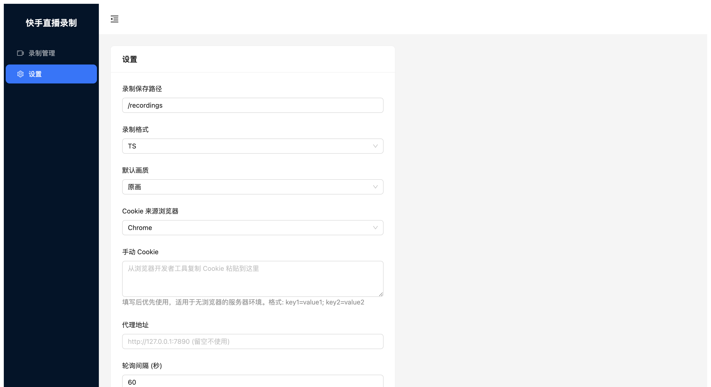

# kuaishou_recorder

快手直播间录制工具，支持 CLI 和 Web UI 两种使用方式。

## 功能

- 支持标准链接 `https://live.kuaishou.com/u/xxx` 和短链接 `https://v.kuaishou.com/xxx`
- 多画质选择：原画 / 蓝光 / 超清 / 高清 / 标清 / 流畅
- 多录制格式：TS / FLV / MP4 / MKV
- 浏览器 Cookie 自动提取（Chrome / Firefox / Safari / Edge / Brave）
- Web UI 管理界面，支持多直播间同时录制
- Docker 部署

## 界面预览

**录制管理**



**设置页面**



## 快速开始

### CLI 模式

```bash
# 安装依赖
uv sync

# 检查直播状态
uv run python kuaishou_recorder.py https://live.kuaishou.com/u/KPL704668133 --check

# 开始录制（默认保存到 ~/kuaishou_live）
uv run python kuaishou_recorder.py https://live.kuaishou.com/u/KPL704668133

# 指定画质和输出目录
uv run python kuaishou_recorder.py https://live.kuaishou.com/u/KPL704668133 --quality HD --output ./recordings

# 使用浏览器 Cookie（避免限流）
uv run python kuaishou_recorder.py https://live.kuaishou.com/u/KPL704668133 --cookies-from-browser chrome

# 录制短链接
uv run python kuaishou_recorder.py https://v.kuaishou.com/Kx0sn17z --cookies-from-browser chrome
```

### Web UI 模式

```bash
# 安装依赖
uv sync

# 构建前端
cd frontend && npm install && npm run build && cd ..

# 启动服务
uv run uvicorn server.app:app --host 0.0.0.0 --port 8000
```

打开浏览器访问 `http://localhost:8000`，在页面上添加直播间：

1. 点击「添加直播间」
2. 输入直播间地址，如 `https://live.kuaishou.com/u/KPL704668133`
3. 选择画质，点击确定
4. 点击「启动」开始监控，主播开播后自动录制

### Docker 部署

```bash
# 构建镜像
docker build -t kuaishou-recorder .

# 启动容器
docker run -d \
  --name kuaishou-recorder \
  -p 8000:8000 \
  -v /data/recordings:/recordings \
  -v /data/config:/root/.kuaishou_recorder \
  kuaishou-recorder
```

打开 `http://your-server:8000`，录制文件保存在宿主机 `/data/recordings/主播名/` 下。

## CLI 参数

| 参数 | 说明 | 默认值 |
|------|------|--------|
| `url` | 直播间地址 | 必填 |
| `-q, --quality` | 画质: OD BD UHD HD SD LD | OD（原画） |
| `-o, --output` | 输出目录 | ~/kuaishou_live |
| `-f, --format` | 录制格式: ts flv mp4 mkv | ts |
| `-c, --cookie` | Cookie 字符串 | - |
| `-b, --cookies-from-browser` | 从浏览器提取 Cookie | - |
| `-p, --proxy` | 代理地址 | - |
| `--check` | 仅检查直播状态 | - |

## Cookie 配置

快手对未登录用户有请求频率限制，配置 Cookie 可以避免限流。

**方式一：自动提取**（需要本地有浏览器且已登录快手）

```bash
uv run python kuaishou_recorder.py https://live.kuaishou.com/u/KPL704668133 --cookies-from-browser chrome
```

**方式二：手动配置**（适用于无浏览器的服务器）

1. 在浏览器中打开快手并登录
2. F12 打开开发者工具 → Application → Cookies → 复制全部 Cookie
3. 在 Web UI 设置页面粘贴到「手动 Cookie」框中

## 环境变量

| 变量 | 说明 | 默认值 |
|------|------|--------|
| `RECORDER_SAVE_PATH` | 录制文件保存路径（Docker 使用） | ~/kuaishou_live |

## 技术栈

- **后端**：Python + FastAPI + SSE
- **前端**：React + TypeScript + Ant Design + Vite
- **录制**：ffmpeg

## 致谢

- [bililive-go](https://github.com/bililive-go/bililive-go) - Web UI 设计参考
- [yt-dlp](https://github.com/yt-dlp/yt-dlp) - 浏览器 Cookie 提取方式参考

## 开源协议

本项目采用 [AGPL-3.0](LICENSE) 协议，任何修改或衍生作品必须以相同协议开源。

## 免责声明

本项目仅供学习和研究使用，不保证功能的完整性、稳定性和安全性。

使用本项目录制直播内容时，请遵守相关法律法规及平台规定，尊重主播的知识产权和隐私权。因使用本项目产生的一切法律后果由使用者自行承担，与项目作者无关。

本项目不隶属于快手科技或其任何关联公司。
